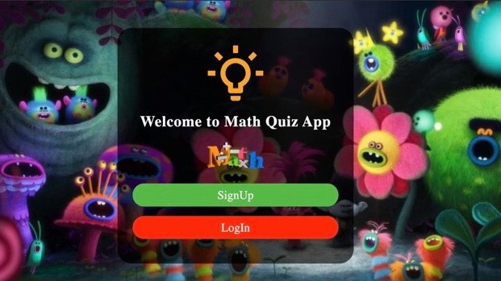
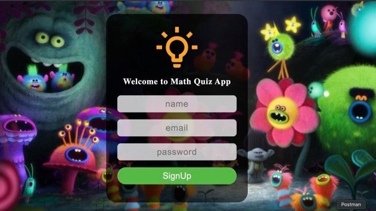
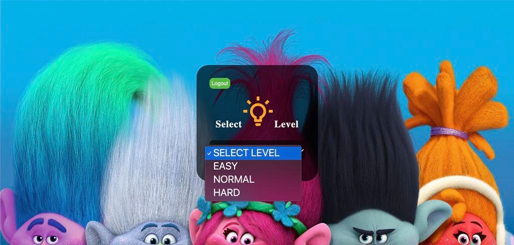
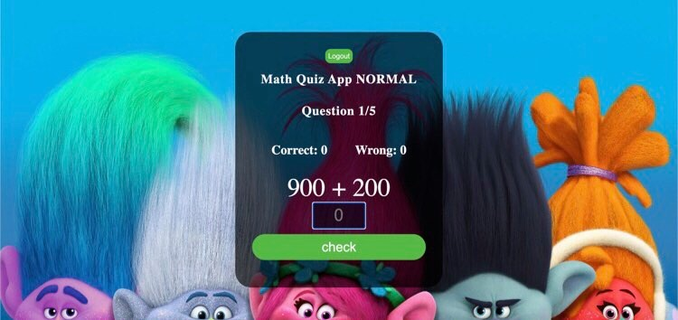
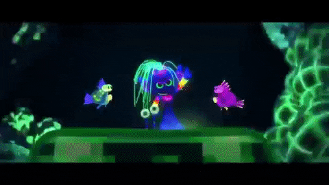
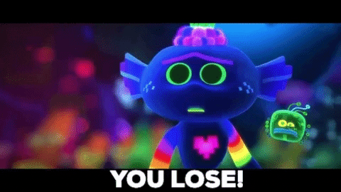

# mern-CalculationApp
Calculation Quiz App with MERN stack
- [Math Quiz App](https://quizmathapp.herokuapp.com/)
## This project is MERN stack :bulb: 

### :house: page 

  

                                                                                                                               
                                                                                                                              
### :bust_in_silhouette: signUp  
  

### :game_die: Select level       
  

### :video_game: Play        
  

### :tada: WIN 
  

### :sob: Lose 
  

#### Always try again :sunglasses:

